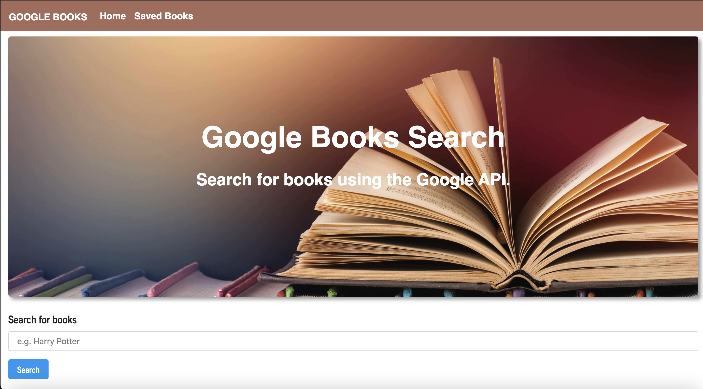
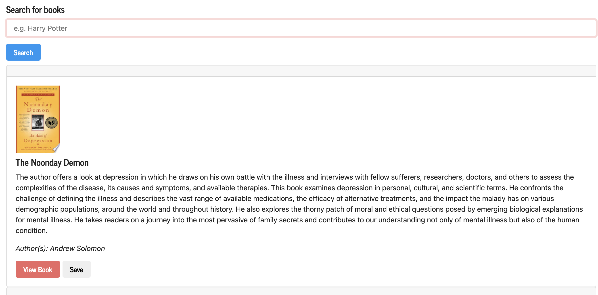

# Table of Contents:
* [Project Description](#Project)
* [Deployed Links](#Links)
* [Usage](#Usage)
* [Credits](#Credits)
* [License](#License)

# Project:
## Title:
# c19-React-Book-Search

## Description:
A react application that allows the user to search using Google API.

As for our homework for this assignment we (Columbia Engineering Bootcamp students) were given the following user story below and acceptance criteria:


## Deployed Link
Coming soon


#Usage
## Final screenshot



## Requirements

```
### Overview

In this activity, you'll create a new React-based Google Books Search app. This assignment requires you to create React components, work with helper/util functions, and utilize React lifecycle methods to query and display books based on user searches. You'll also use Node, Express and MongoDB so that users can save books to review or purchase later.

### Commits

Having an active and healthy commit history on GitHub is important for your future job search. It is also extremely important for making sure your work is saved in your repository. If something breaks, committing often ensures you are able to go back to a working version of your code.

* Committing often is a signal to employers that you are actively working on your code and learning.

  * We use the mantra “commit early and often.”  This means that when you write code that works, add it and commit it!

  * Numerous commits allow you to see how your app is progressing and give you a point to revert to if anything goes wrong.

* Be clear and descriptive in your commit messaging.

  * When writing a commit message, avoid vague messages like "fixed." Be descriptive so that you and anyone else looking at your repository knows what happened with each commit.

* We would like you to have well over 200 commits by graduation, so commit early and often!

* Deploy this application using Heroku, follow our guide on [deploying MERN applications to Heroku](../04-Important/MERNHerokuDeploy.md) to do so.

### Submission on BCS

* **Please submit both the deployed Heroku link to your homework AND the link to the Github Repository!**

### Instructions

* This application requires at minimum 2 pages, check out the following mockup images for each page:

  * [Search](Search.png) - User can search for books via the Google Books API and render them here. User has the option to "View" a book, bringing them to the book on Google Books, or "Save" a book, saving it to the Mongo database.

  * [Saved](Saved.png) - Renders all books saved to the Mongo database. User has an option to "View" the book, bringing them to the book on Google Books, or "Delete" a book, removing it from the Mongo database.

1. Start by using the [01-Ins_Mern/create-react-express](../01-Activities/01-Ins_Mern/create-react-express) example as a base for your application.

2. Add code to connect to a MongoDB database named `googlebooks` using the mongoose npm package.

3. Using mongoose, then create a Book schema.

4. At a minimum, books should have each of the following fields:

* `title` - Title of the book from the Google Books API

* `authors` - The books's author(s) as returned from the Google Books API

* `description` - The book's description as returned from the Google Books API

* `image` - The Book's thumbnail image as returned from the Google Books API

* `link` - The Book's information link as returned from the Google Books API

* Creating `documents` in your `books` collection similar to the following:

    ```js
    {
      authors: ["Suzanne Collins"]
      description: "Set in a dark vision of the near future, a terrifying reality TV show is taking place. Twelve boys and twelve girls are forced to appear in a live event called The Hunger Games. There is only one rule: kill or be killed. When sixteen-year-old Katniss Everdeen steps forward to take her younger sister's place in the games, she sees it as a death sentence. But Katniss has been close to death before. For her, survival is second nature."
      image: "http://books.google.com/books/content?id=sazytgAACAAJ&printsec=frontcover&img=1&zoom=1&source=gbs_api"
      link: "http://books.google.com/books?id=sazytgAACAAJ&dq=title:The+Hunger+Games&hl=&source=gbs_api"
      title: "The Hunger Games"
    }
    ```

#Credits
Thank you to everyone in the Columbia Engineering Bootcamp.

#License
MIT License

Copyright (c) 2021 Casandra McDonald

Permission is hereby granted, free of charge, to any person obtaining a copy
of this software and associated documentation files (the "Software"), to deal
in the Software without restriction, including without limitation the rights
to use, copy, modify, merge, publish, distribute, sublicense, and/or sell
copies of the Software, and to permit persons to whom the Software is
furnished to do so, subject to the following conditions:

The above copyright notice and this permission notice shall be included in all
copies or substantial portions of the Software.

THE SOFTWARE IS PROVIDED "AS IS", WITHOUT WARRANTY OF ANY KIND, EXPRESS OR
IMPLIED, INCLUDING BUT NOT LIMITED TO THE WARRANTIES OF MERCHANTABILITY,
FITNESS FOR A PARTICULAR PURPOSE AND NONINFRINGEMENT. IN NO EVENT SHALL THE
AUTHORS OR COPYRIGHT HOLDERS BE LIABLE FOR ANY CLAIM, DAMAGES OR OTHER
LIABILITY, WHETHER IN AN ACTION OF CONTRACT, TORT OR OTHERWISE, ARISING FROM,
OUT OF OR IN CONNECTION WITH THE SOFTWARE OR THE USE OR OTHER DEALINGS IN THE
SOFTWARE.
